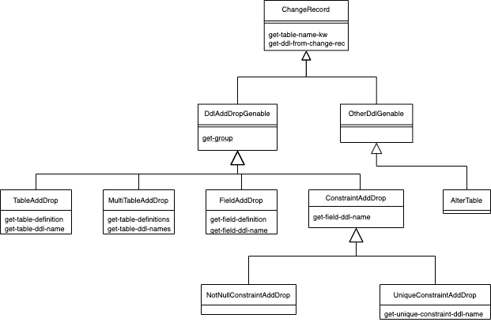

# declarative-ddl

WIP

Declarative database schemas in Clojure data structures.  Create Postgresql (maybe other DBs to come) migrations from those declared schemas when the change.  Similarly to how Django and Rails models are declared by the developer and migrations are created from those.

Also creates clojure.spec.alpha schemas from the field definitions in the schema declaration.

## Table of Contents

- [Usage](#usage)
    - [declare the schema](#declare-the-schema)
    - [cli - make-migration and migrate](#cli-make-migration-and-migrate)
- [Development](#development)
    - [Automated Testing](#automated-testing)
    - [CLJS](#cljs)
    - [Change Record Hierarchy Diagram](#change-record-hierarchy-diagram)
- [License](#license)

## Usage

### declare the schema

create this file: `app_with_db/resources/declarative-ddl/entities.edn`

example:

	[{:name "cledgers-user"
	  :fields [{:name "username"
	            :type :character
	            :max-length 30
	            :unique true}
	           {:name "first-name"
	            :type :character
	            :max-length 30}
	           {:name "last-name"
	            :type :character
	            :max-length 30}
	           {:name "email"
	            :type :character
	            :max-length 30}
	           {:name "is-admin"
	            :type :boolean
	            :default false}
	           {:name "last-login"
	            :type :date-time
	            :null true}
	           {:name "is-active"
	            :type :boolean
	            :default false}
	           {:name "pass"
	            :type :character
	            :max-length 300}
	           ]}
	 {:name "payee"
	  :fields [{:name "name"
	            :type :character
	            :max-length 100
	            :unique true}
	           {:name "time-created"
	            :type :date-time
	            :default :current-time}
	           {:name "created-by"
	            :type :foreign-key
	            :references :cledgers-user}]}
	 {:name "ledger"
	  :fields [{:name "name"
	            :type :character
	            :max-length 100
	            :unique true}]}
	 {:name "xaction"
	  :fields [{:name "uuid"
	            :type :character
	            :max-length 100
	            :unique true}
	           {:name "description"
	            :type :character
	            :max-length 250}
	           {:name "payee"
	            :type :foreign-key
	            :references :payee}
	           {:name "amount"
	            :type :numeric
	            :total-length 10
	            :decimal-places 2}
	           {:name "date"
	            :type :date}
	           {:name "time-created"
	            :type :date-time
	            :default :current-time}
	           {:name "created-by"
	            :type :foreign-key
	            :references :cledgers-user}
	           {:name "ledger"
	            :type :foreign-key
	            :references :ledger}]}]

### cli - make-migration and migrate

#### make migration file
    $ lein run -d ../app_with_db make-migration

#### migrate
    $ lein run -d ../app_with_db -b "postgresql://localhost/app_db?user=app" -e migrate

## Development

### automated testing

- clj `$ lein test`
- cljs `$ lein doo node test`

### CLJS

#### run figwheel repl

- open `./figwheel.html` file in browser
- `$ lein figwheel repl`

### Change Record Hierarchy Diagram
generated 2/20/2020

## License

Copyright © 2019 Frank Henard

MIT
